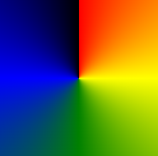
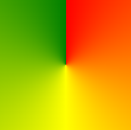
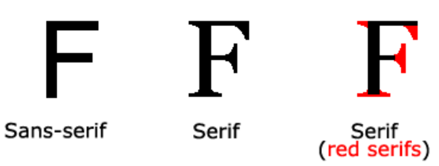

# Cascading Style Sheets (CSS)


CSS is a crucial component of web development that defines how HTML elements should be displayed on various media, including screens, paper, and other platforms. By providing a set of rules and styles, CSS streamlines the design process and saves considerable effort, allowing developers to control the layout and appearance of multiple web pages simultaneously. External stylesheets, organized in separate CSS files, contribute to the maintainability and scalability of web projects, facilitating consistent and efficient styling across different pages.

## CSS Syntax
```css
h1 {color:blue;font-size:12px;}
```


## External CSS

1. **Create an External CSS File:**
   Start by creating a separate CSS file, for example, "styles.css". In this file, you can define your styles as you would in a regular `<style>` tag within HTML. Save this file with a ".css" extension.

   ```css
   /* styles.css */
   body {
       font-family: 'Arial', sans-serif;
       background-color: #f4f4f4;
   }

   h1 {
       color: #333;
   }

   .highlighted {
       background-color: yellow;
   }
   ```

2. **Link the CSS File to Your HTML Document:**
   In your HTML file, within the `<head>` section, use the `<link>` tag to reference the external CSS file. The `href` attribute should point to the location of your CSS file, and the `rel` attribute should be set to "stylesheet".

   ```html
   <!-- index.html -->
   <!DOCTYPE html>
   <html lang="en">
   <head>
       <meta charset="UTF-8">
       <meta name="viewport" content="width=device-width, initial-scale=1.0">
       <link rel="stylesheet" href="styles.css">
       <title>Your Web Page Title</title>
   </head>
   <body>
       <h1 class="highlighted">Hello, External CSS!</h1>
       <p>This is a paragraph with external styling.</p>
   </body>
   </html>
   ```

## Inline CSS  
Inline CSS is a way of applying styles directly to HTML elements using the `style` attribute. Inline styles are applied directly to individual HTML elements within their respective tags.

```html
<!DOCTYPE html>
<html lang="en">
<head>
    <meta charset="UTF-8">
    <meta name="viewport" content="width=device-width, initial-scale=1.0">
    <title>Inline CSS Example</title>
</head>
<body>
    <h1 style="color: blue; text-align: center;">This is a Heading with Inline Styles</h1>
    
    <p style="font-family: 'Arial', sans-serif; font-size: 16px; line-height: 1.5;">
        This paragraph has inline styles applied directly to the HTML elements.
    </p>
</body>
</html>
```

## Text Color
The color field is used to define the color of the text going to be displayed.It plays an important role is the visual appeal of the webpage.
``` css
P {
  color: blue;
}
```
## Background Color

Background color is a fundamental element of web design, providing the canvas for your content and establishing the overall ambience of your webpage. In CSS, you can manipulate background color with the background-color property, offering a range of options to customize your visual experience.

``` css
P {
  background-color: blue;
}
```

## CSS Gradients
CSS gradients let you display smooth transitions between two or more specified colors.CSS defines three types of gradients:

* Linear Gradients (goes down/up/left/right/diagonally)
``` css
#grad {
  background-image: linear-gradient(red, yellow);
}
```

* Radial Gradients (defined by their center)
``` css
#grad {
  background-image: radial-gradient(red, yellow, green);
}
```
* Conic Gradients (rotated around a center point)
``` css
#grad {
  background-image: conic-gradient(red, yellow, green);
}
```
| 5 Color Conic Gradient |  3 Color Conic Gradient |
|---|---|
|  |  |

## Background Images
The `background-image` property sets one or more background images for an element.
By default, a background-image is placed at the top-left corner of an element, and repeated both vertically and horizontally.
``` css
body {
 background-image: url("paper.gif");
 background-color: #cccccc;
}
```
## Border 
The CSS border properties allow you to specify the style, width, and color of an element's border.

``` css
p.dotted {border-style: dotted;}
p.dashed {border-style: dashed;}
p.solid {border-style: solid;}
p.double {border-style: double;}
p.groove {border-style: groove;}
p.ridge {border-style: ridge;}
p.inset {border-style: inset;}
p.outset {border-style: outset;}
p.none {border-style: none;}
p.hidden {border-style: hidden;}
p.mix {border-style: dotted dashed solid double;}
```
## Border Radius
The `border-radius` property is used to add rounded borders to an element:

``` css
p {
  border: 2px solid red;
  border-radius: 5px;
}
```
## Margins
The CSS margin properties are used to create space around elements, outside of any defined borders.

CSS has properties for specifying the margin for each side of an element:

* margin-top
* margin-right
* margin-bottom
* margin-left

``` css
p {
  margin-top: 100px;
  margin-bottom: 100px;
  margin-right: 150px;
  margin-left: 80px;
}
```
## Paddings
The CSS padding properties are used to generate space around an element's content, inside of any defined borders.

CSS has properties for specifying the padding for each side of an element:

* padding-top
* padding-right
* padding-bottom
* padding-left

``` css
div {
  padding-top: 50px;
  padding-right: 30px;
  padding-bottom: 50px;
  padding-left: 80px;
}
```
## Height & Width
The height and width properties are used to set the height and width of an element.They do not include padding, borders, or margins. It sets the height/width of the area inside the padding, border, and margin of the element.


``` css
div {
  height: 200px;
  width: 50%;
  background-color: powderblue;
}
```
The CSS max-width property is used to set the maximum width of an element.
``` css
div {
  max-width: 500px;
  height: 100px;
  background-color: powderblue;
}
```
## Math Functions 
The CSS math functions allow mathematical expressions to be used as property values. Here, we will explain the calc(), max() and min() functions.

The `calc()` function performs a calculation to be used as the property value.

```css
#div1 {
  position: absolute;
  left: 50px;
  width: calc(100% - 100px);
  border: 1px solid black;
  background-color: yellow;
  padding: 5px;
}
```
```css
#Content{
    margin: auto;
    width: min(70%, 1200px);
    padding-top: 100px;
    padding-bottom: 30px;
}
```

## Fonts
In CSS there are five generic font families:

* Serif fonts have a small stroke at the edges of each letter. They create a sense of formality and elegance.
* Sans-serif fonts have clean lines (no small strokes attached). They create a modern and minimalistic look.
* Monospace fonts - here all the letters have the same fixed width. They create a mechanical look. 
* Cursive fonts imitate human handwriting.
Fantasy fonts are decorative/playful fonts.



### Font Family 
The `font-family` property specifies the font for an element.
```css
p.a {
  font-family: "Times New Roman", Times, serif;
}

p.b {
  font-family: Arial, Helvetica, sans-serif;
}
```

### Font Style 
The font-style property is mostly used to specify italic text.

This property has three values:

* normal - The text is shown normally
* italic - The text is shown in italics
* oblique - The text is "leaning" (oblique is very similar to italic, but less supported)

```css
p.normal {
  font-style: normal;
}

p.italic {
  font-style: italic;
}

p.oblique {
  font-style: oblique;
}

```

### Font Weight
The `font-weight` property specifies the weight of a font:
```css
p.normal {
  font-weight: normal;
}

p.thick {
  font-weight: bold;
}
```

### Font Variant
The `font-variant` property specifies whether or not a text should be displayed in a small-caps font.
```css 
p.normal {
  font-variant: normal;
}

p.small {
  font-variant: small-caps;
}
```

### Font Size
The `font-size` property sets the size of the text.
Absolute size:

* Sets the text to a specified size
* Does not allow a user to change the text size in all browsers (bad for accessibility reasons)
* Absolute size is useful when the physical size of the output is known

Relative size:

* Sets the size relative to surrounding elements
* Allows a user to change the text size in browsers

```css 
h1 {
  font-size: 40px;
}
h2 {
  font-size: 2.5em; 
}
p {
  font-size: 100%;
}
```
### Font Shorthand
To shorten the code, it is also possible to specify all the individual font properties in one property.

The font property is a shorthand property for:

* `font-style`
* `font-variant`
* `font-weight`
* `font-size/line-height`
* `font-family`

``` css
p.a {
  font: 20px Arial, sans-serif;
}

p.b {
  font: italic small-caps bold 12px/30px Georgia, serif;
}
```
## CSS Display Property
```css
p.ex1 {display: none;}
p.ex2 {display: inline;}
p.ex3 {display: block;}
p.ex4 {display: inline-block;}
```

## Flexbox
The Flexible Box Layout Module, makes it easier to design flexible responsive layout structure without using float or positioning
```css
<div class="flex-container">
  <div>1</div>
  <div>2</div>
  <div>3</div>
</div>
```
## Position Property
The position property specifies the type of positioning method used for an element (static, relative, absolute, fixed, or sticky)

```css
h2 {
  position: absolute;
  left: 100px;
  top: 150px;
}
```
## Z Index
The `z-index` property specifies the stack order of an element.

An element with greater stack order is always in front of an element with a lower stack order.
```css 
img {
  position: absolute;
  left: 0px;
  top: 0px;
  z-index: -1;
}
```
## Overflow
The overflow property specifies whether to clip the content or to add scrollbars when the content of an element is too big to fit in the specified area.

The overflow property has the following values:

* visible - Default. The overflow is not clipped. The content renders outside the element's box
* hidden - The overflow is clipped, and the rest of the content will be invisible
* scroll - The overflow is clipped, and a scrollbar is added to see the rest of the content
* auto - Similar to scroll, but it adds scrollbars only when necessary
```css
div {
  width: 200px;
  height: 65px;
  background-color: coral;
  overflow: visible;
}
```
## Alignment
``` css 
.center {
  margin: auto;
  width: 50%;
  border: 3px solid green;
  padding: 10px;
}
```
```css
.center {
  text-align: center;
  border: 3px solid green;
}
```
```css
img {
  display: block;
  margin-left: auto;
  margin-right: auto;
  width: 40%;
}
```
```css
.right {
  position: absolute;
  right: 0px;
  width: 300px;
  border: 3px solid #73AD21;
  padding: 10px;
}
```
