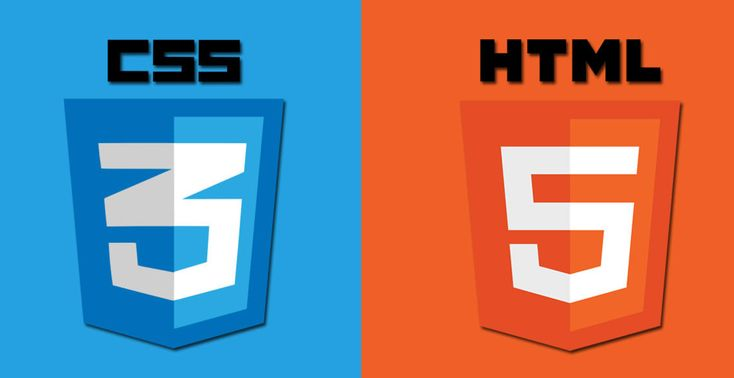

# Welcome to WebDev 101 

 By Abhijat Bhardwaj & Chaitanya Keshri 

 #### This doc aims to give a holistic overview on two of the most important topics for any web development project i.e HTML and CSS.
 #### HTML is the language using which we define the structure of any webpage you see on the internet and to make it look amazing we take help of the Cascading Style Sheets (CSS)

## What you will learn

- HTML Elements
  - Subpoint 1
  - Subpoint 2
    - Sub-subpoint A
    - Sub-subpoint B
  - Subpoint 3

 
[HTML](html.md)
[CSS](css.md)

